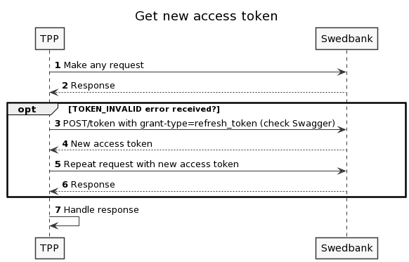

## Access and refresh token validity

PSD2 API uses OAuth based authorisation to secure requests, more information can be found at OAuth official documentation: [OAuth about refresh tokens](https://auth0.com/learn/refresh-tokens/).

In short, in order to use PSD2 API smoothly, correct implementation to operate with both tokens is needed:<br />
`access_token` - short lived token that needs to be sent with most requests (check Swagger to find out if a particular endpoint requires it).<br />
`refresh_token` - long lived token that is used to get new access token when previous one expires.<br />
Access token is going to be valid for a limited period of time (provided in json element  `expires_in`, usually 1 hour). When access token expires, `refresh_token` has to be provided in order to obtain a new access token using `.../psd2/token?grant_type=refresh_token...` . Access token can be renewed while refresh token is valid. Due to performance reasons access token should be renewed only when it expires.
It's important to understand that access token might expire at any time, so basically any endpoint that's being called might receive expired token's error. Validity of OAuth 2.0 refresh token is subject to agreement (usually defined as 180 days). Below is the use case scenario of how to identify expired acccess token error and how to refresh it and continue.


1. Any request is made;
2. Get the response. In case used access-token is expired, 401 `TOKEN_INVALID` error is received;
3. Call POST/token and provide both `refresh_token` and `grant_type=refresh_token` in request parameters/headers;
4. Response contains new `access_token` that should be used for further requests;
5. Repeat your initial request that was made in step 1 and use new access token to call it;
6. Get the response;
7. Handle response.


Example of `.../psd2/token?grant_type=refresh_token...` response that contains both access and refresh tokens:
```JSON
{
   "access_token":"sf681f6s8-fs81f68ase-86as16e8f-3351eafs851",
   "token_type":"bearer",
   "expires_in":3600,
   "refresh_token":"asefsef566-86asf-yiky6-a6e86j",
   "scope":"PSD2"
}
```
