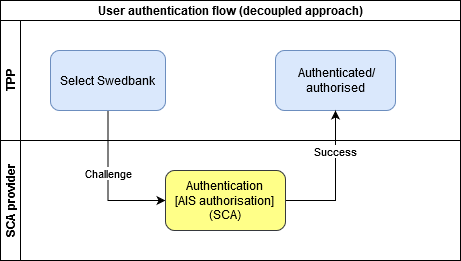
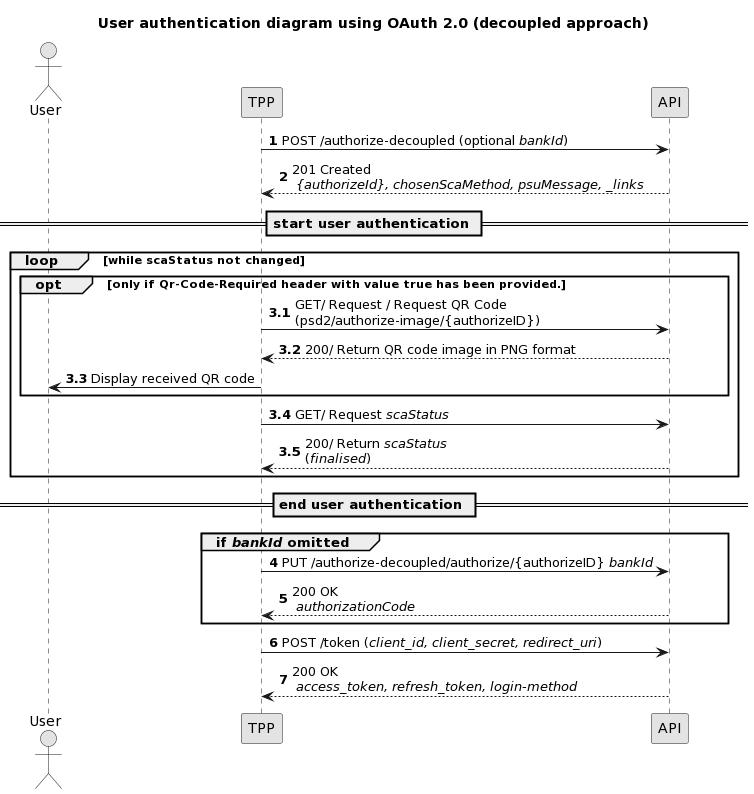

## User Authentication using OAuth 2.0 decoupled approach diagrams

### Simple flow diagram

> TPP may use API to get available login methods, participating Saving banks and other information needed for login process. This information should be cached and refreshed each 24 hours.

1. User in TPP environment selects Swedbank authentication method, profile & information needed for selected authentication method;
2. User receives a challenge to security device and performs SCA;
   TPP can provide additional scopes (more details on [scopes chapter][scopes-chapter]) to get Account information service authorisation from user with single SCA;
3. User is back to TPP.

### Sequence diagram

1. Initiate the OAuth 2.0 request with user's login details to Swedbank.
   >In Sweden user can have engagement in one bank (Swedbank or Savingsbank) or in several. Already in this POST request TPP can provide `bankId` to which bank user's profile should be logged in. Alternatively `bankId` can be omitted. If user has engagement in one bank (Swedbank or Savings bank) user is logged in to that bank even if `bankId` is not provided. In case user has engagement in several banks TPP can proceed further omitting `bankId` and `bankId` can be provided later with PUT request;
2. TPP gets a response with created resource;  
User authentication starts;
3. Check `scaStatus` every 3-5s until value 'finalised' or 'failed' is received:
   1. [Optional] Request QR code image (more about QR code information could be found in [QR code chapter][qr-code-chapter]);
   1. TPP gets image in PNG format;
   1. TPP displays received image to user. Image is updated every 1s.
   1. TPP requests `scaStatus`;
   1. If SCA is OK and `bankId` was provided with POST or user profile has engagement in one bank (Swedbank or Savings bank), `scaStatus` is 'finalised' and response includes `authorizationCode`
      >In case user profile has engagement in several banks and `bankId` was omitted with POST, error message is returned asking to provide `bankId`.
4. If `bankId` is not provided in the 1st request then TPP should provide `bankId` in case user profile has engagement in several banks;
5. Response includes `authorizationCode`;
6. Call `/token` endpoint and exchange `access_code` to OAuth 2.0 token;  
   `https://psd2.api.swedbank.com/psd2/token?grant_type=authorization_code&client_id=l71c2ad437f0fd44d68b2ea3f89b76a28d&client_secret=079603ebf92446f8a70e0ddc11f8d11d&code=fa020756-8255-4c92-a975-4bd1916d4199&redirect_uri=https://www.swedbank.com/openbanking`  
   or  
   `https://{countryCode}.psd2.api.swedbank.com/psd2/token?grant_type=authorization_code&client_id=l71c2ad437f0fd44d68b2ea3f89b76a28d&client_secret=079603ebf92446f8a70e0ddc11f8d11d&code=fa020756-8255-4c92-a975-4bd1916d4199&redirect_uri=https://www.swedbank.com/openbanking`
7. Get OAuth2.0 tokens for further API usage. Login method is also provided in headers;

* Please note that some login methods (Mobile BankID) may raise error if there is ongoing login session.
