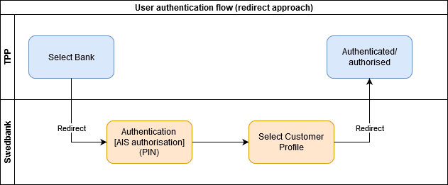
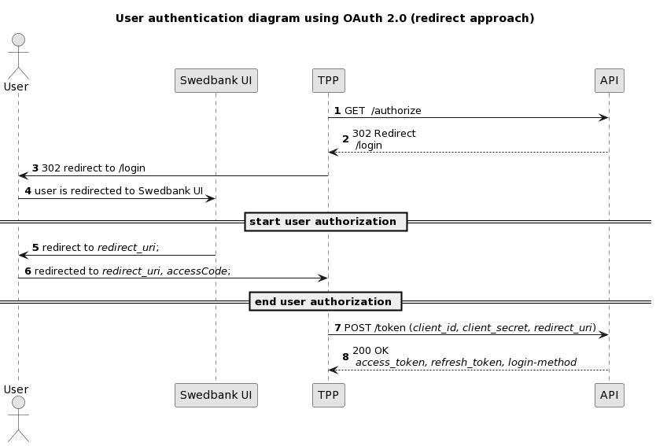

## User authentication using OAuth 2.0 redirect approach diagrams

### Simple flow diagram

1. User selects Swedbank authentication method in TPP‘s environment;
2. User is redirected to Swedbank UI where logs in and authenticates:

   **[optional] AIS pre-authorisation:** TPP can provide additional scopes (more details on [scopes chapter][scopes-chapter]) to get Account information service authorisation from user with single SCA;

   **[optional]** QR code may be displayed due to security reasons for BankID.

3. User selects customer profile which (s)he represents (private or corporate);
4. User is redirected back to TPP environment.

### Sequence diagram

1. TPP initiates OAuth 2.0 request from server side 
   `https://psd2.api.swedbank.com/psd2/authorize?bic=SANDSESS&state=somestring&client_id=l71c2ad437f0fd44d68b2ea3f89b76a28d&redirect_uri=https://www.swedbank.com/openbanking&response_type=code&scope=PSD2sandbox` or  
   `https://{countryCode}.psd2.api.swedbank.com/psd2/authorize?state=somestring&client_id=l71c2ad437f0fd44d68b2ea3f89b76a28d&redirect_uri=https://www.swedbank.com/openbanking&response_type=code&scope=PSD2sandbox` ;
2. HTTP code `302` response with redirect link in `Location` header is returned;
3. Forward the redirect link returned with HTTP code `302` to user browser;
4. User get redirected to Swedbank environment to `/login` page;
   >in case of bic=`HABALT22` and additional scope `{API_type}account_list` is requested, user is presented with confirmation page on giving out list of accounts to TPP;  
   >in case of bic=`HABALV22` and additional scopes, `{API_type}balances` and/or `{API_type}transactions`, are requested, user is presented with confirmation page on giving out balance/statement (up to 90 days) data of his payment accounts.

   User authentication procedure starts.

5. After login user is redirected to TPP `redirect_uri` with `access_code` and `state` parameters;
6. TPP from server side calls `/token` endpoint and exchange `access_code` to OAuth 2.0 token.  
   `https://psd2.api.swedbank.com/psd2/token?grant_type=authorization_code&client_id=l71c2ad437f0fd44d68b2ea3f89b76a28d&client_secret=079603ebf92446f8a70e0ddc11f8d11d&code=fa020756-8255-4c92-a975-4bd1916d4199&redirect_uri=https://www.swedbank.com/openbanking`  
   or  
   `https://{countryCode}.psd2.api.swedbank.com/psd2/token?grant_type=authorization_code&client_id=l71c2ad437f0fd44d68b2ea3f89b76a28d&client_secret=079603ebf92446f8a70e0ddc11f8d11d&code=fa020756-8255-4c92-a975-4bd1916d4199&redirect_uri=https://www.swedbank.com/openbanking`
7. Get OAuth2.0 token for further API usage;
8. Response with created `access_token` and `refresh_token`. Login method is also provided in headers.
