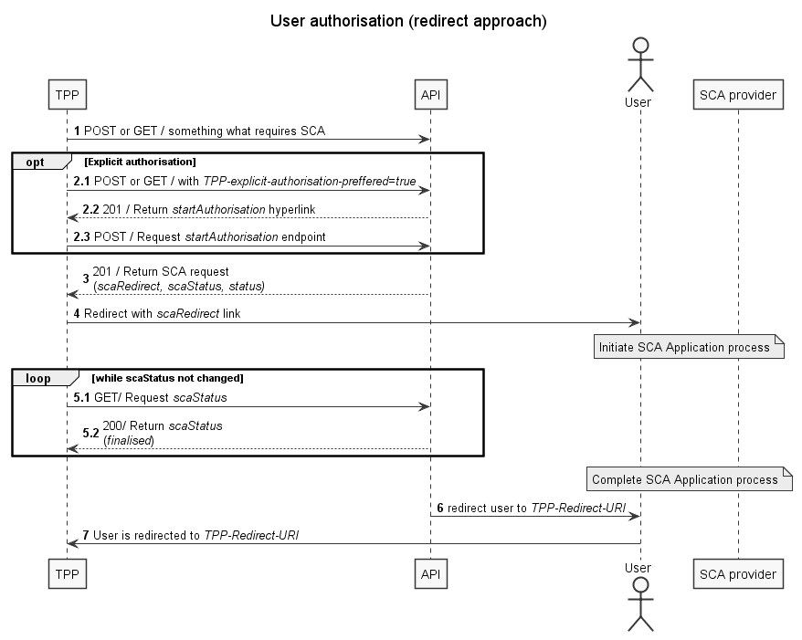
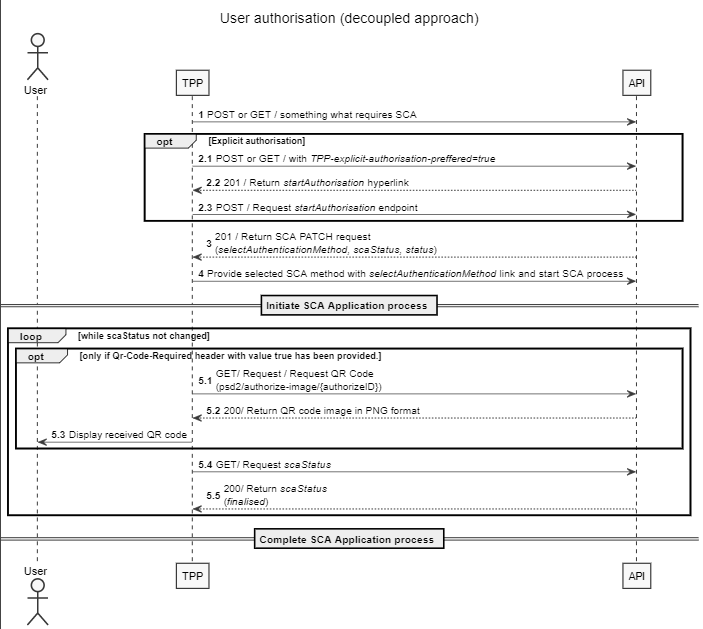
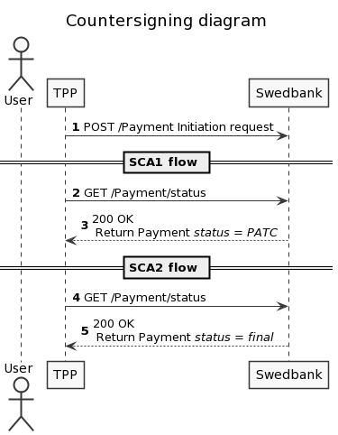
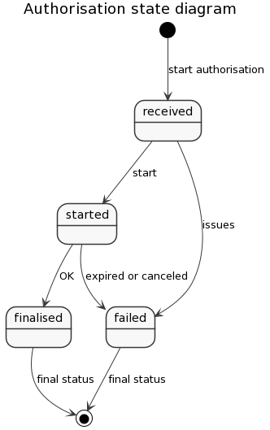

# User authorisation using SCA !heading

Some API calls requires SCA (user must approve/sign request by using PIN). <!--SE case there is no PIN2) -->SCA can be implemented either by using redirect or decoupled methods. Default integration method is redirect if nothing is selected.

In redirect mode API generates links and TPP must redirect user to these pages. In these pages corresponding `payment/consent/…` information is displayed to a user and the user authorises using security device.

In decoupled integration mode SCA is performed without displaying bank pages. Process relies on third party identity provider (e.g. Bank-ID, Smart-ID, Mobile-ID). In decoupled mode API generates SCA requests to third party identity provider, user gets details of requested authorisation action in his security device and approves it using PIN code.

>Authorisation resource is valid 5 minutes if not stated differently. Later authorisation status is set to `'failed'`.

## Authentication procedures issued by Swedbank to users

| Country | Sweden (SE)/ Saving banks | Latvia (LV) | Estonia (EE) | Lithuania (LT) |
| --- | --- | --- | --- | --- |
|Smart-ID | - | R/D | R/D | R/D |
|Mobile-ID | - | - | R/D | R/D |
|Card-ID | - | R | R | R |
|Mobile BankID | R/D | - | - | - |
|BankID on card | R | - | - | - |
|Security token | R | R | R | R |
|Biometric data* | - | R/D | R/D | R/D |
|eParaksts mobile| - | R/D | - | -|

> R – Redirect approach;  
> D – Decoupled approach;  
> \* - limited to login and payment (up to 100 EUR 10 times in a row) signing;  

## Authorisation redirect approach

In redirect integration method TPP needs to provide redirects URIs in the `TPP-Redirect-URI` header in case when SCA is required. Redirects happen after the user has completed the SCA process in Swedbank API user interface (UI) and have to be redirected back to TPP.

>`TPP-Redirect-URI` header is required for all SCA requests in redirect integration method.

1. Any request which requires SCA is sent;
1. [Optional] Explicit authorisation:
   1. If `TPP-explicit-authorisation-preferred` is set to 'true', explicit authorisation is started; 
   >**Note:**  Explicit authorisation allows more detailed control of authorisation process needed for decoupled integration method or countersigning (check section [Authorisation decoupled approach](#authorisation-decoupled-approach)). It is not advised for redirection integration.
   1. Response has steering link in `startAuthorisation` parameter and TPP must request it;
   1. Start authorisation and return `selectAuthenticationMethod` link. More technical details are available on [Developer portal][Developer-Portal].
1. If request requires user SCA and `TPP-explicit-authorisation-preferred` is omitted or false in response `_links` object `scaRedirect` link is returned;
1. Redirect the user using `scaRedirect` steering link to Swedbank UI environment, where user completes SCA flow;
1. Check `scaStatus` every 5s until value 'finalised' or 'failed' is received:
   1. TPP requests `scaStatus`;
   1. Response with `scaStatus:finalised`;  
   If authorisation has failed, new authorisation may be created and processed.
1. After successfully completing the SCA flow the user is redirected to the URL provided earlier in the `TPP-Redirect-URI`;
1. TPP continues usual flow.

>**Please note** that authorisation resource will be created automatically (unless specified otherwise over `TPP-Explicit-Authorisation-Preferred` header) by the Swedbank after the submission of the endpoint POST method. Explicit authorisation should only be used when decoupled approach is selected or when countersigning of the payment is required.

## Authorisation decoupled approach

In order to start decoupled SCA approach TPP needs to provide header parameter `TPP-Redirect-Preferred` with value 'false'. With decoupled SCA approach Swedbank asks the user to do SCA via dedicated SCA application which is independent from the online banking front end. TPP must inform the user about SCA by sending a corresponding user messages and challenge code.

After the SCA having been processed between Swedbank and user, the TPP then needs to ask for the result of transaction to be completed.

1. Any request which requires SCA is sent;
1. Explicit authorisation:
   1. [Optional] If `TPP-explicit-authorisation-preferred` is set to 'true', explicit authorisation is started. Explicit authorisation allows more detailed control of authorisation process needed for decoupled integration method or countersigning;
   2. Response has steering link in `startAuthorisation` parameter and TPP must request it;
   3. Start authorisation and return `selectAuthenticationMethod` link. More technical details are available on [Developer Portal][developer-portal].
1. If request requires user SCA and `TPP-explicit-authorisation-preferred` is omitted or 'false' in response `_links` object `selectAuthenticationMethod` link is returned;
1. Provide selected SCA method by using the `selectAuthenticationMethod` PUT to Swedbank environment, this updates user's selected SCA method and starts SCA process by sending a challenge to user's SCA application;  
   >**Note:** TPP must check whether customer's IP address match Bank ID service – in case it doesn't, `Qr-Code-Required:true` header must be present in this request.  
1. Check `scaStatus` every 5s until value 'finalised' or 'failed' is received:
   1. [Optional] Request QR code image (more about QR code information could be found in [QR code chapter][qr-code-chapter]);
   2. TPP gets image in PNG format;
   3. TPP displays received image to user. Image is updated every 1s.
   4. TPP requests `scaStatus`;
   5. Response with `scaStatus:finalised`.  
   If authorisation has failed, new authorisation may be created and processed;
1. User completes authentication process.

>**Please note** that authorisation resource is created automatically (unless specified otherwise over `TPP-Explicit-Authorisation-Preferred` header) by the Swedbank after the submission of the endpoint POST method. Explicit authorisation should only be used when decoupled approach is selected or when countersigning of the payment is required.

## Countersigning

Countersigning is SCA Approach that supports the authorisation of a payment by several users. In Swedbank API countersigning can be used in PIS flow to authorise single payment, signing basket or bulk payments. This authorisation method can be used by corporate customers in Sweden and Baltics. 
Several authorisation requests have to be performed until the payment resource is fully signed and payment can be executed. SCA processes can be performed in a row or simultaneously. 
Partially authorised payment (after the first signature is performed) can be found and finalised by PSU in other digital channels. 
It is always important to check payment status before proceeding with an explicit authorisation for the second signature.
The corporate customer is responsible for administration of user signing rights for corporate representatives. Users can have rights to: 
* Initiate payment
* Add first (partial) signature to the payment (payment status becomes PATC)
* Add final signature to the payments (payment status becomes final)

Countersigning example:

1. Initiate payment using `POST /{version}/payments/{payment-product}` with correct payment details provided in request body:
   * Process SCA for the first signer. The first signer can be same as payment initiator or different user with corresponding signing rights.
1. Check payment status by calling `GET /{version}/payments/{payment-product}/{paymentID}/status` endpoint;
1. Payment status is returned. If returned payment status is PATC second signature is required:
   * Process SCA for the second signer. Second signer cannot be the same user as the first signer.
1. Check payment status until it is finalised.

Note! there is also an option to create multiple authorisation resources explicitly and sent simultaneously to several users having signing rights.

Payment statuses and descriptions can be found in chapter  [payment statuses and descriptions](#payment-status).

## BankID

Swedbank in Sweden supports BankID (Smart card which is called *BankID on card*, mobile phone application - *Mobile BankID*) citizen identification solution.

#include "authorisation-service/qr-code.md"

## Biometric data

Biometric in LT, LV and EE is based on usage of Swedbank mobile application. It is limited to mobile device biometric capabilities.

When biometric login process is started user gets notification on mobile device. Following this notification activates Swedbank mobile application for Biometric authorisation.

Application displays login message and hash code (must be displayed to user) and requires biometric confirmation (e.g. fingerprint or face recognition sensor).

After biometric confirmation is successfully done - user is redirected to TPP (or TPP gets result while calling `/scaStatus` endpoint).

### Biometric signing

 Biometric signing is applicable to payment signing. Signing amount limit and number of payments in a row is applied for biometric signing and can vary depending on country. Counter is reset with other SCA method applied in Swedbank Mobile application. Different SCA method does not reset the counter in Internet bank or other channels. Same rules of usage of biometric signing aplly for all digital channels.
 
 Example of usage. Limit for biometric signing is 100 EUR but not more than 10 payments in a row. 
 > * eg. 5 payments authorised with `SIMPLE_ID` (Biometric data) and then >100 EUR payment is authorised with `MOBILE_ID` in Internet bank. This doesn't reset the counter.
 > * eg. 9 payments authorised with `SIMPLE_ID` and then 5 EUR payment is signed in Swedbank Mobile application with `SMART_ID`. This resets counter and you can sign 10 payments with `SIMPLE_ID` again.

 SCA method used for authentication will be offered as default method for payment signing.
 If user has created token using biometric data - payment will be signed with biometric data too. However if `SIMPLE_ID` can not be applied due to limitations described above then previously applied SCA method will be offered.

 Swedbank Mobile application displays signing message, challenge code (must be displayed to user) and requires biometric data confirmation (e.g. fingerprint or face recognition sensor). After biometric data confirmation is successfully done - user is redirected to TPP (or TPP gets result while calling `/scaStatus` endpoint).

## Authorisation status

There are several states in authorisation flow. The state diagram shows final and non-final authorisation states. State is returned in the `scaStatus` parameter.

\

### State descriptions

* `received` - An authorisation or cancellation-authorisation resource has been created successfully.
* `started` - The addressed SCA routine has been started. In a redirect approach PSU has followed scaRedirect URL, in a decoupled approach PSU started interaction in SCA app but not yet authorised.
* `finalised` - The SCA routine has been finalised successfully (including a potential confirmation command). This is a final status of the authorisation resource.
* `failed` - The SCA routine failed. This is a final status of the authorisation resource.

> TPP should not call for `scaStatus` after final state (finalised, failed) is received.
