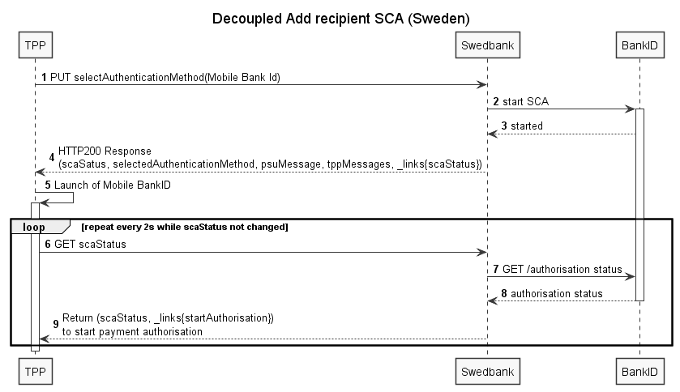

### Add recipient

In Swedbank Sweden payment requires registration of recipient. If recipient is not registered user has to add it so there are additional steps the user and TPP must complete. New recipient account has to be authorised using PSU owned SCA method eligible in Swedbank Sweden.

#### Extended Mobile BankID
 Extended Mobile BankID is required if Mobile BankID is used for recipient authorisation (for login or payment authorisation not extended Mobile BankID is accepted but new recipient authorisation requires extended Mobile BankID, this sequrity level applies in all digital channels in Swedbank Sweden). The extension of Mobile BankID can be done using a security token, a code card or a physical ID. To simplify the extension of Mobile BankID, the bank will add deep links in the API flow making the activation flow easily accessible. The deep links will be able to link to corresponding flows both in the internet bank and in the mobile bank app. The flow for activating extended Mobile BankID will, for security reason, only be available in our own channels and require a separate session.

 In case TPP would like to know if PSU has extended Mobile BankID as early as possible such information is provided with token response in PSU authentication flow (more information in chapter [User authentication method](#User-authentication-method)). Nevertheless to know if extended Mobile BankID is required in particular payment flow can only be known when PSU tries to authorise new recipient (PSU can have several different devices with Mobile BankID installed and different device can be chosen in login, recipient authorisation and payment authorisation flows).

#### Add recipient in redirect approach

In redirect approach user must register new recipient in Swedbank UI in payment authorisation screen so SCA is required. 
If not extended Mobile BankID is chosen by PSU the PSU will be linked to Swedbank own channel to proceed with the extension of Mobile BankID. The entension flow will be opened in a separate tab so the ongoing payment ahuthorisation session won't be interupted and PSU will be able to return to payment flow and continue with the extended Mobile BankID.

#### Add recipient in decoupled approach

In decoupled approach Add recipient flow control is done from TPP side. If Mobile BankID extension is needed TPP will be provided with Mobile BankID extension links and can redirect PSU to extend the Mobile BankID so that a new recipient can be authorised. 

##### Prerequisites for this flow

* user doesn't have recipient in the list;
* user authentication (section [User authentication ](#user-authentication) is already done;
* Payment initiation (section [Payment initiation](#payment-initiation) is already done.

##### Decoupled Add recipient SCA diagram description

1. Initiate payment authorisation using `PUT /{version}/payments/se-domestic-credit-transfers/authorisation` with `selectAuthenticationMethod` selected;
    >**Note:** TPP doesn't know whether user has recipient registered in the system so payment authorisation is expected by TPP in this step.
2. SCA is initiated with BankID;
    >**Note:** In this step Swedbank identifies that recipient is not registered yet so starts recipient authorisation before payment authorisation.
3. Status is received that SCA successfully started;
4. Response code `200 OK` is returned. `psuMessage` should be delivered to user;
    >**Note:** if `tppMessage` is returned, it means that Recipient authorisation is initiated, so TPP additionally needs to authorise the payment.
5. Mobile BankID application is launched on the user device;
6. [loop] Check `scaStatus` until value 'finalised' or 'failed' is received. If authorisation has failed, but payment is correct, new authorisation may be created and processed;
    >**Note:** initiated authorisation has expiration, so there is no sense to query for `scaStatus` longer than expiration time. For more information check [User authorisation using SCA][sca-chapter] section.
7. BankID service is checked for status;
8. SCA status is returned to Swedbank. If Mobile BankID extension is needed the deep-link to extension flow will be provided;
9. If status changes to 'finalised' TPP can start decoupled payment authorisation by following `startAuthorisation` steering link (see section [User authorisation using SCA][sca-chapter]). For any other status please check error messages for more information. If Mobile BankID extension is needed SCA status will be set to 'failed' and Mobile BankID extension link will be provided with the SCA status response. In such case TPP should expose this link to PSU to extend Mobile BankID in Swedbank internet bank or mobile bank. After PSU is done with extension, TPP has to repeat 'Add recipient' flow by POSTing new authorisation and then repeating the flow from step 1. 
