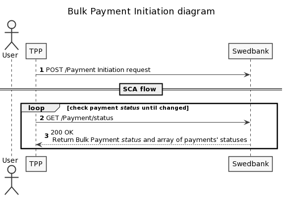

## POST bulk payments (Baltics only)

Payment Initiation Service offers creation of a bulk payments resource for authorising several payments debiting from same account with one SCA. The main difference from Signing baskets is that bulk payments are initiated as an array of payment with one POST request while in basket case each single payment has to be posted first and then basket recource of initiated payments is created. 
Bulk payment can be initiated on behalf of Swedbank Private or Corporate user for sepa domestic payments only. Both redirect and decoupled approach is applicable for bulk payment.

The limitation of payments in one bulk request is 100.

Bulk payments are supported for Baltic banks only. 

1. Initiate bulk payment using `POST /{version}/bulk-payments` with correct payments' details in request body;
1. Complete SCA according to preferred integration method;
    >If authorisation has failed, but payment is correct, new authorisation can be created and processed.
1. Check bulk payment status by calling `GET/{version}/bulk-payments/{paymentID}/status` status endpoint. Bulk payment status is returned. 
   * Array of statuses and remittance information of payments in the bulk will be provided as well as bulk payment resource status. If all payments in the bulk have same status, bulk payment takes over that status. If status of at least one payment in the bulk differs bulk payment resource gets status PART.

Bulk payment can be cancelled by calling `DELETE /{version}/bulk-payments/{paymentID}` endpoint.

