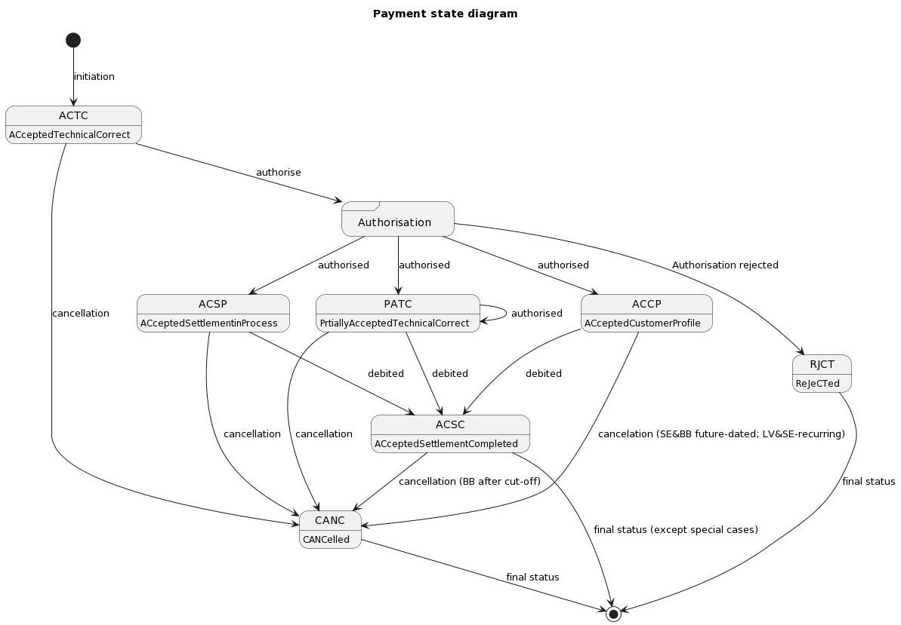

## Payment status

In this section payment (transaction) life cycle is described and payment available states and transitions are provided. Every payment trasitions through it's life cycle from initial status to the final status. The transaction status is filled with codes of the ISO 20022.

\

**Status descriptions**

* `ACTC` - AcceptedTechnicalValidation. Payment has been initiated successfully meaning that authentication and syntactical and semantic validation are successful.
Now authorisation needs to be performed in order to start processing of payment. More info in [user authorisation chapter][sca-chapter].

* `CANC` - Canceled. Status of canceled Payments. Payment initiation has been canceled before or during execution. This is final status.

* `ACSP` - AcceptedSettlementInProcess. The settlement routine regarding the debtor account of the payment has already
been initiated and prepared for account debiting. All preceding checks such as technical validation and customer profile were successful,
but payment account is not debited yet. Usually it is related with nuances of payment processing or payment was not debited before cut-off time and trading room,
therefore the payment initiation has been accepted for execution. Payment processing is being put on hold and is going to be processed once trading room or other preconditions are available again. In some cases immediate payment gets this status after cut-off time when account is debited. Such payment can be still cancelled by TPP while it is in status ACSP.

* `PATC` - Status of partially authorised payments within a multilevel SCA process (countersigning). Payment initiations which are authorised by at least one PSU, but which are not yet finally authorised by all applicable PSU.

* `ACCP` - AcceptedCustomerProfile. Preceding check of technical validation was successful. Customer profile check was also successful.
Payment processing has been successfully started and prepared to be debited when future date becomes current date. Once payment is executed status changes to `ACSC`

   > Future dated payment gets this status after authorisation (signing).

   > Recurring payment has this status until end date.

* `ACSC` - AcceptedSettlementCompleted. Authentication, syntactical and semantical validation is successful.
Payment has been successfully processed and debited meaning that settlement on the debtor's account has been completed. This is a final status.

> There are very special cases when payment status ACSC may change (after account debiting payment can be stopped by some AML and fraud prevention procedures, errors detection by clearing or accepting bank).
> Final confirmation may be acquired only by checking payment acceptance in creditor account statement as account crediting is done by receiving bank and not controlled by debiting bank.
> For foreign payment creditor bank usually rejects payment by sending money back to creditor account by means of new payment and old payment status will not change.
> Future dated payment gets ACSC status on execution date when account is debited.

* `RJCT` - Rejected. Payment initiation or individual transaction included in the payment initiation has been rejected. This is final status.

*  `PART` – PartiallyAccepted. A number of transactions have been accepted, whereas another number of transactions have not yet achieved 'accepted' status. This status can be obtained only in Bulk payment. Use tppMessages for details of failed payments.

> Please note that if payment is in final status (RJCT, CANC, ACSC*) it can't be transitioned to another status. This means that TPP should stop calling for payment status.

## Requesting payment status after refresh token's expiration

It is possible that some payments, for example future dated ones, would be completed after 180 days and refresh token would be expired. Since access to its status might still be relevant, payment status can be requested `/{version}/{payment-service}/{payment-product}/{paymentId}/status` without access-token parameter.
Please check Support API in Swagger for more details.

