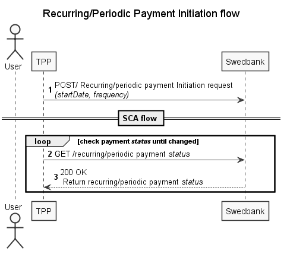

## Recurring/periodic payment

Payment Initiation Service offers initiation of a recurring/periodic payment request. Recurring/Periodic payments are always registered for a future payment date. Payment is executed a regular intervals after the first payment date.

### Recurring/periodic payments in Baltics (redirect only)

Recurring payments in Baltics enabled for private and corporate customers, SEPA domestic payments in redirect approach only.

Recurring payment is set through `/periodic-payments/sepa-credit-transfers` endpoint by adding additional mandatory input parameters: `startDate` (first payment date), `frequency` and optional `endDate` parameter.

When concluding recurring payment agreement, customer should accept Swedbank service conditions.

### Recurring/periodic payments in Sweden

Recurring/periodic payments in Sweden enabled for private and corporate customer, domestic and international in both redirect and decoupled approach.

Recurring payment is set through `/periodic-payments/{payment-product}` endpoint by adding additional mandatory input parameters: `startDate` (first payment date), `frequency`.

### Recurring/periodic payment sequence diagram

1. Initiate payment using `POST /{version}/periodic-payments/{payment-product}` with `startDate`, `frequency` and other payment details provided in request body;
   Then start SCA according to preferred integration method.
2. Check SCA status until value 'finalised' or 'failed' is received;
    >If authorisation has failed, but payment is correct, new authorisation may be created and processed.
3. Check payment status by calling `GET /{version}/periodic-payments/{payment-product}/{paymentID}/status` endpoint. Check possible [payment statuses and descriptions](#payment-status).
