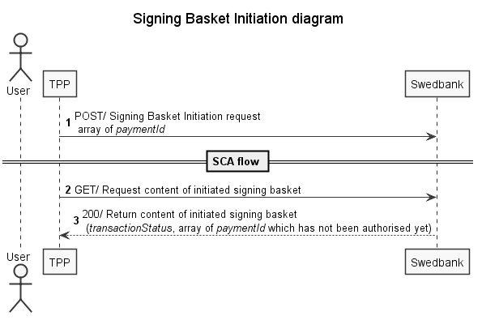
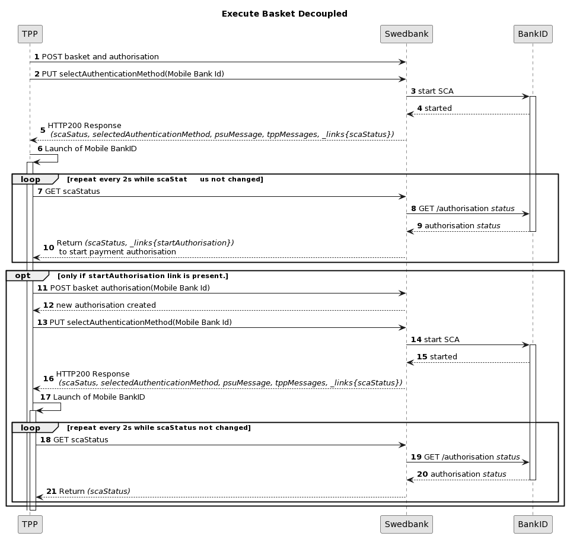

## POST signing basket (SE only)

Payment Initiation Service offers creation of a signing basket resource which allows authorisation of several payments with one SCA. During basket creation, request body contains array of multiple payments' ids, indicating which payments will be involved.
Signing basket is supported for Swedish banks only and it can be initiated on behalf of Swedbank Private or Corporate user for domestic transfers/payments only. Both - redirect and decoupled flows are supported. Maximum number of payments allowed in the basket is 100.

### Basket creation and execution in redirect flow

1. Initiate signing basket using `POST /{version}/signing-baskets` with correct list of `paymentId` provided in request body;
    >Complete SCA according to preferred integration method.
    If authorisation has failed, but the signing basket is correct, new authorisation may be created and processed.

1. Check signing basket content by calling `GET /{version}/signing-baskets/{basketID}` endpoint;
1. Signing basket transaction status is returned;
   * Array of `paymentId` that failed is returned.

Signing basket status can be checked by calling `GET /{version}/signing-baskets/{basketID}/status` endpoint.

Signing basket can be cancelled by calling `DELETE /{version}/signing-baskets/{basketID}` endpoint.

### Decoupled Basket execution

Decoupled basket execution is similar to other decoupled signing flows. However, there is additional information in GET SCA status response for clarifying basket's payments failing reasons if there are any. 

It's important for cases when only some payments are invalid, but others are OK to proceed.

The following diagram describes decoupled basket execution. Please note that diagram covers basket execution with and without recipients adding.

1. POST basket with payments selected. POST authorisation. The description of this step is simplified with the main focus set to following steps in diagram;
2. Call `PUT /{version}/signing-baskets/{basketID}/authorisations/{authorisationId}` endpoint;
3. Swedbank initiates Mobile Bank ID signing session;
4. Initiation successful;
5. PUT response, its psuMessage field, that should be displayed for a customer, specifies whether it's a signing of basket payments or recipients list first;
6. Customer should be redirected to Mobile Bank ID app (or notified that it should be opened);
7. Check basket's SCA status;
8. Swedbank confirms current status with Bank ID service;
9. Response's received;
10. SCA status return - unless it's one of final SCA statuses ('finalised' or 'failed'), repeat cycle. In case not extended Mobile BankID was selected by PSU as authorisation method, TPP receives SCA status 'failed' with error message explaining that the extended Mobile BankID is required. The list of affected payments is also provided so that TPP is informed what payments cannot be authorised due to incomplete 'Add recipient' flow. Mobile BankID extension link will be provided in same response so that TPP could expose this link to the PSU to extend Mobile BankID. The extension will be performed in Swedbank Internet bank or Mobile bank. Now in order to authorise recipients with extended Mobile BankID repeat the flow from step 1. Alternatively at step 10 of the Basket decoupled flow TPP can decide to skip recipient authorisation and proceed with remaining payments in the basket (the ones that do not require recipient authorisation), this can be done by following further steps of the flow ;
11. Only if response at step 10 contains startAuthorisation link, use it to create new authorisation (payment wasn't executed yet, only recipient was signed). Note that the first authorisation in the basked will be created for recipient signing and the subsequent authorisation will be used for payment signing. In order to repeat recipient authorisation flow in the basket, new basket has to be posted (steps 1-10 repeated);
12. New authorisation created, use it for subsequent requests;
13. Call `PUT /{version}/signing-baskets/{basketID}/authorisations/{authorisationId}` endpoint;
14. Swedbank initiates Mobile Bank ID signing session;
15. Initiation successful;
16. PUT response, its psuMessage field, that should be displayed for a customer, specifies whether it's a signing of basket payments or recipients list first;
17. Customer should be redirected to Mobile Bank ID app (or notified that it should be opened);
18. Check basket's SCA status;
19. Swedbank confirms current status with Bank ID service;
20. Response's received;
21. SCA status return - unless it's one of final SCA statuses, repeat cycle. SCA status confirms basket payments execution completion.
