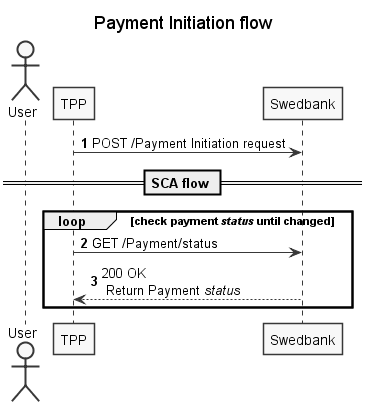

## Payment initiation

1. Initiate payment using `POST /{version}/payments/{payment-product}` with correct payment details provided in request body:
   * Start SCA according to preferred integration method;
   * Check SCA status until value 'finalised' or 'failed' is received. If authorisation has failed, but payment is correct, new authorisation may be created and processed;
   * Initiated authorisation expires after 5 mins, so there is no sense to query for `scaStatus` longer.
1. Check payment status by calling `GET /{version}/payments/{payment-product}/{paymentID}/status` endpoint. Check possible [payment statuses and descriptions](#payment-status);
1. Payment status is returned.